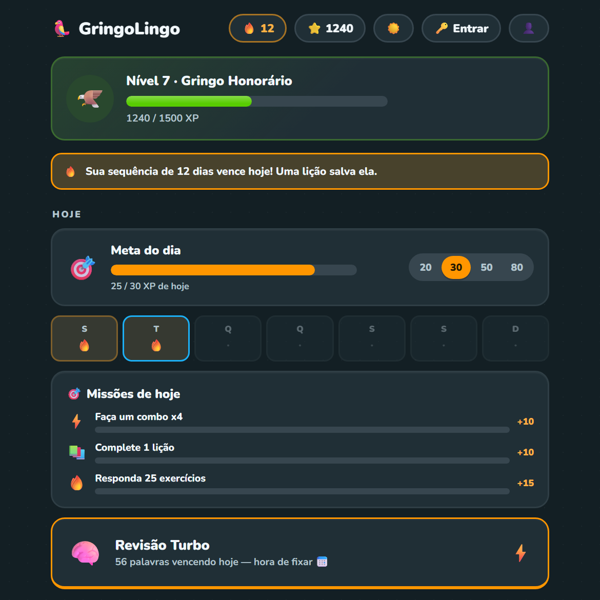
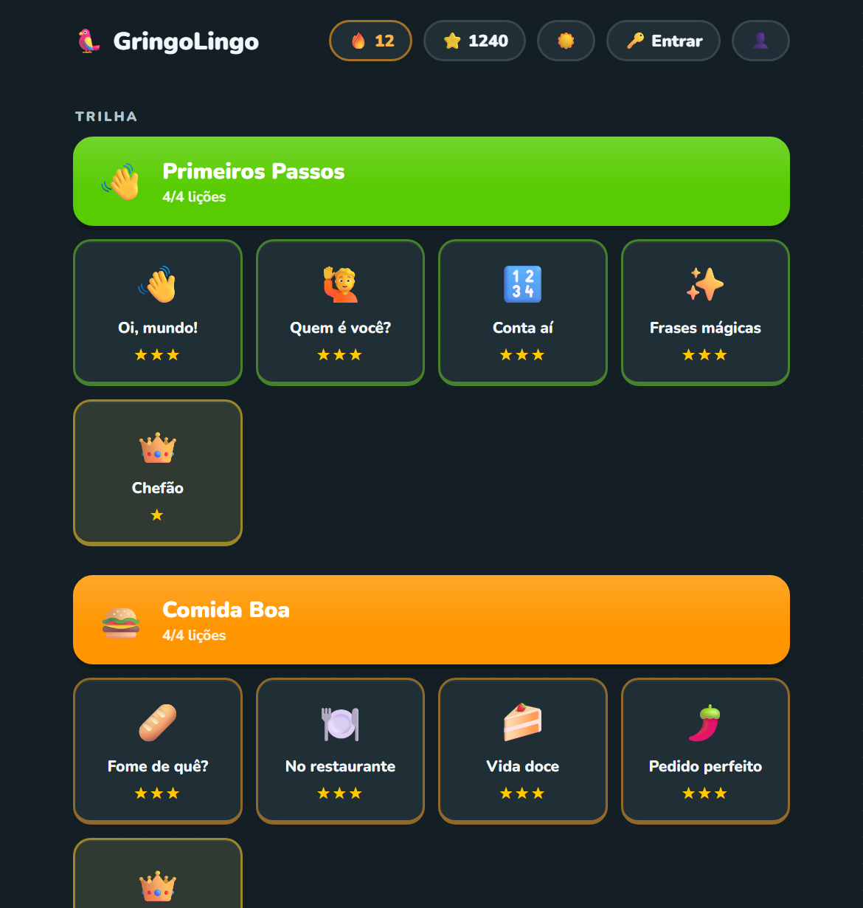
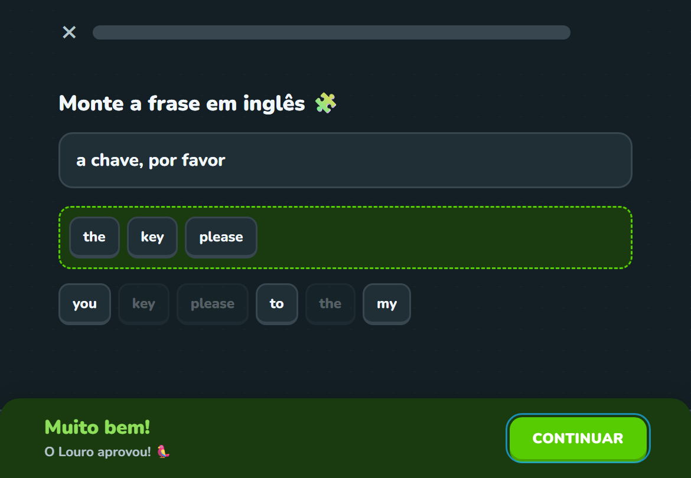
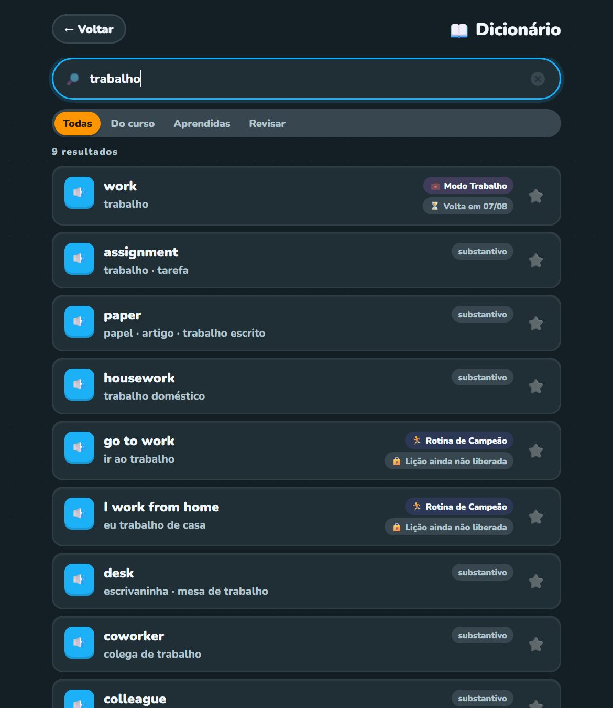
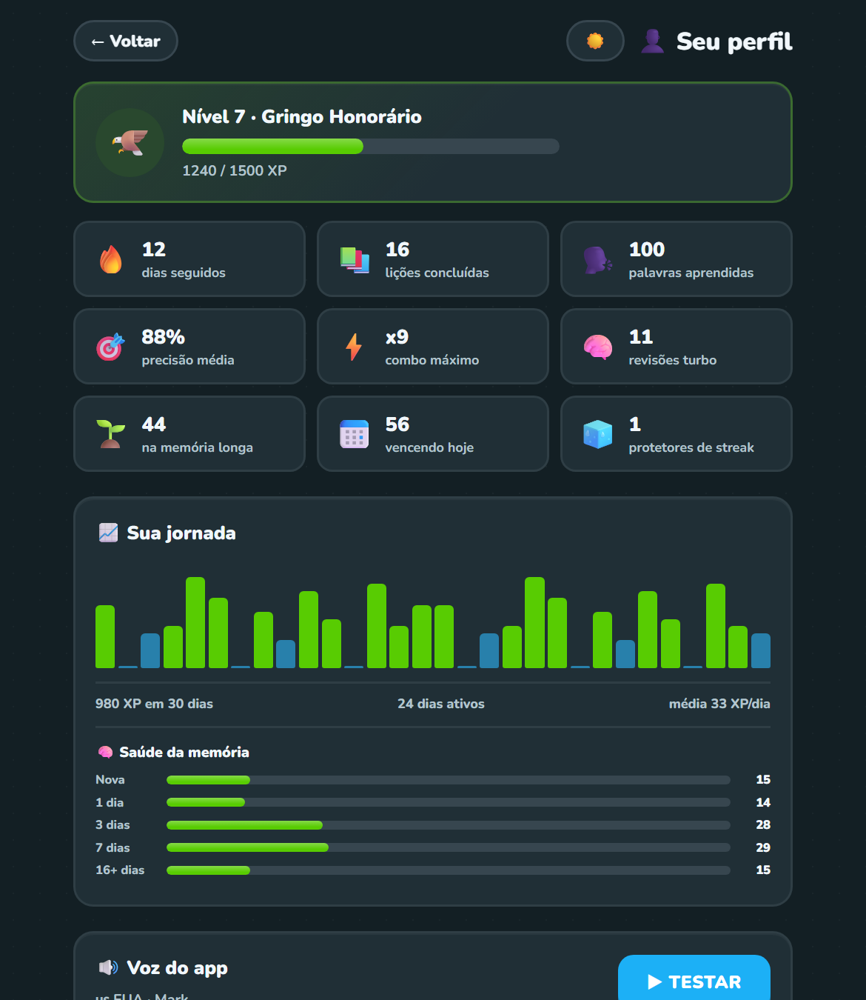
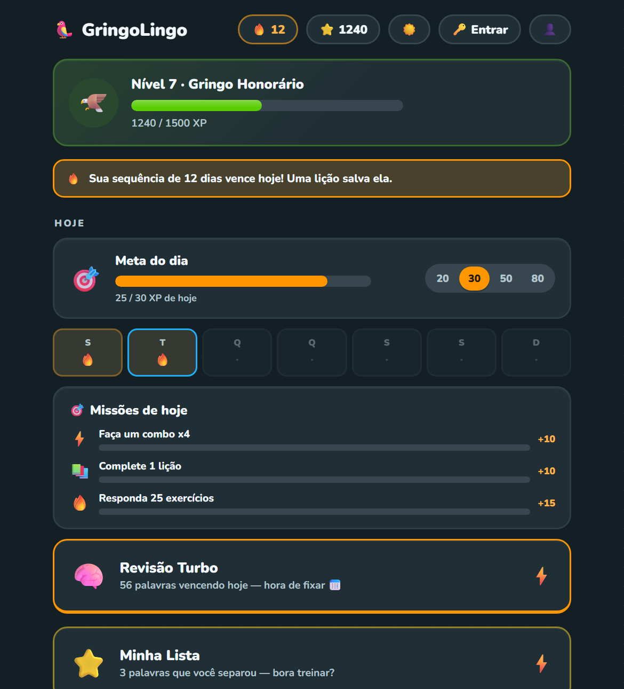
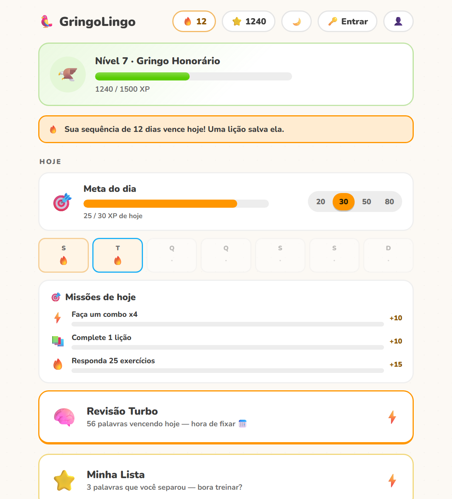

<div align="center">

# GringoLingo 🦜

**Aprender inglês como quem joga: lições de cinco minutos, XP, streak e uma memória que sabe a hora de te cobrar.**

Um curso de inglês completo — 8 unidades, 10 tipos de exercício, repetição espaçada, dicionário de
quase 3 mil palavras e sincronização entre aparelhos — escrito em **HTML, CSS e JavaScript puro**.
Sem framework, sem bundler, sem `npm install`. O que está no repositório é exatamente o que roda no
navegador.

### ➡️ [**Abrir o app**](https://lucasrmagalhaes.github.io/gringolingo-js/) ⬅️

[](https://lucasrmagalhaes.github.io/gringolingo-js/)
[](#decisões-técnicas)
[](#decisões-técnicas)
[](#testes)
[](https://lucasrmagalhaes.github.io/gringolingo-js/)
[](#arquitetura)



</div>

---

## Por dentro

| A trilha | Um exercício |
| --- | --- |
|  |  |
| Unidades coloridas, desbloqueio progressivo, até 3 estrelas por lição e o **Chefão** no fim de cada unidade. | Montar frase, digitar, ouvir, falar, ligar pares… com uma correção que explica o erro. |

| O dicionário | Sua jornada |
| --- | --- |
|  |  |
| Uma busca só, aceita português ou inglês, com ou sem acento — e mostra em que pé está a sua memória de cada palavra. | Gráfico de XP dos últimos 30 dias e a distribuição das palavras pelas caixas de revisão. |

<div align="center">

| Tema escuro | Tema claro |
| --- | --- |
|  |  |

</div>

---

## O que tem

### Aprendizado

- **8 unidades × 4 lições = 32 lições**, com 215 palavras e frases: Primeiros Passos, Comida Boa,
  Modo Viagem, Modo Trabalho, Família & Amigos, Casa Doce Casa, Corpo São e Rotina de Campeão.
  Desbloqueio progressivo e até 3 estrelas por lição.
- **10 tipos de exercício**: múltipla escolha EN→PT e PT→EN, digitar a tradução, montar frase com
  peças, o que você ouviu, o que isso significa, ditado de frase, completar a lacuna, falar em inglês
  (reconhecimento de voz, com botão de pular) e ligar os pares. Todo áudio tem o botão 🐢 para ouvir
  devagar.
- **Chefão de unidade**: liberado quando as 4 lições estão feitas. 12 exercícios difíceis, sem
  múltipla escolha, com 3 vidas.
- **Correção que perdoa o que é para perdoar**: contrações (`don't` = `do not`), traduções
  alternativas por item, pontuação, acento e um errinho de digitação (distância de Levenshtein ≤ 1).
- **Feedback que ensina**: ao errar uma frase, a resposta certa aparece com as palavras que faltaram
  destacadas e o que você escreveu a mais riscado. Itens com nota de gramática mostram a dica na hora
  (“estados usam *to be*, não *have*”), e 4 lições abrem com um card explicando a estrutura.
- **Revisão espaçada de verdade (Leitner)**: cada palavra tem uma caixa e volta a ser cobrada em
  1, 3, 7, 16 e 35 dias. Acertou, sobe de caixa; errou, cai para a primeira e reaparece amanhã.
  A home mostra quantas palavras vencem hoje.
- **Minha Lista**: favorite palavras no dicionário e treine só elas.
- **Dicionário embutido**: 2.979 verbetes (as 215 do curso + um banco das palavras mais frequentes do
  inglês), com classe gramatical, áudio e — para as do curso — o status da sua memória (🌱 memorizada,
  📅 vencendo hoje, ⏳ volta em 07/08…). Carregado sob demanda, só quando você abre a tela.

### Hábito e gamificação

- **Meta diária de XP** configurável (20 / 30 / 50 / 80), com o quadro da semana.
- **3 missões que trocam todo dia**, sorteadas de forma determinística a partir da data.
- **Streak com protetor**: perdoa um dia perdido, e você ganha um novo protetor a cada 5 lições
  perfeitas. O app avisa quando a sequência está para vencer.
- **10 níveis** com títulos que vão de *Turista Perdido* a *Rei da Gringa*, **18 conquistas**, XP com
  bônus de combo, confete e efeitos sonoros sintetizados no WebAudio (nenhum arquivo de áudio no
  repositório).
- **Desafio por link**: termine uma lição e mande o link para alguém tentar bater a sua pontuação.
- **Card de progresso**: um PNG 1080×1080 desenhado no canvas, pronto para as redes, via Web Share
  API (ou download, se o aparelho não suportar).
- **Louro 🦜**, o mascote, comenta cada resposta.

### Conta e sincronização

- **Funciona 100% sem conta.** O progresso mora no `localStorage`; login é opcional.
- **Login por e-mail ou Google** (Supabase Auth). O botão do Google só aparece se o provedor estiver
  realmente ativo no projeto — o app detecta sozinho.
- **Merge conservador** entre o aparelho e a nuvem: nada de “o último que salvou ganha”. Veja em
  [decisões técnicas](#decisões-técnicas).
- **Fila de reenvio**: sem rede, a pilha da conta mostra ⚠️ e o envio é retentado quando a conexão
  volta ou a aba fica visível de novo.
- **Backup em arquivo**: exporta e importa o progresso em JSON, sem depender de nuvem nenhuma.
- **LGPD**: dá para apagar a conta inteira pelo perfil — uma RPC `security definer` que só consegue
  apagar o próprio usuário, porque o alvo vem do JWT assinado e não do cliente.

### PWA e offline

- **Instalável** no Android e no iPhone; abre em tela cheia, com ícone próprio.
- **Funciona offline**: o service worker precacheia o app inteiro e serve o `index.html` como
  fallback de navegação.
- **Aviso de versão nova** no app já aberto: “✨ Nova versão disponível — tocar para atualizar”.
- **Lembrete diário** opcional por notificação, no horário que você escolher.

### Acessibilidade e detalhes

- Teclado: **1–4** escolhem a opção, **Enter** verifica e avança, **Esc** sai da lição.
- Foco gerenciado a cada troca de tela, `aria-live` no feedback, `aria-pressed` nas opções e rótulos
  descritivos nos botões.
- `prefers-reduced-motion` respeitado — inclusive nas *view transitions* entre telas.
- Tema claro e escuro, com a cor da barra do sistema acompanhando.
- **Voz configurável**: sotaque (🇺🇸 🇬🇧 🇦🇺…, conforme as vozes instaladas no aparelho), qual voz usar
  e a velocidade da fala, com botão de testar na hora. E um botão de mudo para o silêncio total.
- **Tela de diagnóstico** em `?debug`: os últimos 30 erros capturados, com a tela de origem. Nada é
  enviado para lugar nenhum.

---

## Arquitetura

Uma SPA sem router: `index.html` é uma casca com `<div id="app">`, e cada tela é uma função que
redesenha esse nó. O helper `h()` — 30 linhas em `js/util.js` — faz as vezes de JSX.

| Módulo | O que faz |
| --- | --- |
| `js/app.js` | Todas as telas e o fluxo entre elas: home, trilha, lição, resultado, dicionário, perfil, login, novidades e diagnóstico. |
| `js/game.js` | O estado do jogador: XP, streak, estrelas, conquistas, missões, agenda de Leitner, `localStorage`, export/import e o merge com a nuvem. |
| `js/exercises.js` | Sorteia, monta e corrige os 10 tipos de exercício — incluindo o diff palavra a palavra e os distratores que nunca entregam a resposta. |
| `js/data.js` | O conteúdo: unidades, lições, itens, notas de gramática, níveis, conquistas, missões e as falas do mascote. |
| `js/dicionario.js` | Busca única em português e inglês (normalizada, sem acento), com ranking por tipo de casamento, filtros e status de memória. |
| `js/dicionario-dados.js` | O banco de 2.903 verbetes, importado dinamicamente só quando o dicionário abre. |
| `js/nuvem.js` | Supabase: sessão, e-mail, Google, vinculação de identidades, download/upload do progresso e a tradução dos erros para português. |
| `js/audio.js` | Efeitos sonoros sintetizados no WebAudio, vibração e a pronúncia via `speechSynthesis` (escolha de voz e velocidade). |
| `js/compartilhar.js` | Desenha o card 1080×1080 de progresso no canvas e dispara a Web Share API. |
| `js/erros.js` | Log em anel dos últimos 30 erros no `localStorage`, alimentado por `error` e `unhandledrejection`, exposto em `?debug`. |
| `js/util.js` | `h()`, embaralhar, amostra, aleatório. É só isso. |
| `js/config.js` | URL e anon key do projeto Supabase. |
| `sw.js` | Service worker: precache versionado, network-first na navegação, stale-while-revalidate nos assets. |
| `servidor.js` | Servidor estático mínimo em Node, só para desenvolvimento. |
| `tests/` | A suíte do `node --test`, sem dependências. |
| `docs/supabase.sql` | O schema do backend versionado: tabela, RLS, trigger de carimbo e a RPC de exclusão de conta. |

### Decisões técnicas

**Vanilla JS, sem build.** ES modules nativos servidos como estão. Sem bundler, sem transpiler, sem
`node_modules`, sem lockfile para envelhecer. O arquivo que você lê no repositório é byte a byte o que
o DevTools mostra, o deploy é um `git push` para o GitHub Pages, e daqui a três anos ainda vai abrir.
Para um app pessoal que precisa durar mais que a moda do mês, isso vale mais que qualquer conforto de
dev server.

**Leitner para a revisão espaçada.** Cinco caixas, com intervalos de 1, 3, 7, 16 e 35 dias. Acerto sobe
uma caixa e adia; erro zera e traz para amanhã. É o algoritmo mais simples que entrega o essencial da
repetição espaçada — sem a complexidade (e o estado) de um SM-2 — e cabe inteiro em `agendar()`, cinco
linhas. A distribuição das caixas vira o gráfico de “saúde da memória” no perfil.

**Merge conservador no sync multi-dispositivo.** Dois celulares abertos na mesma conta não podem fazer
você perder XP. Então `mesclarEstado()` nunca sobrescreve: XP e estatísticas entram por `Math.max`,
estrelas por lição ficam com a maior, conquistas / erros / favoritas são união de conjuntos e o
histórico resolve dia a dia. A agenda de revisão é o caso mais delicado, e a regra é deliberadamente
pessimista: fica com a **menor** caixa e a **data mais próxima** dos dois lados — na dúvida você revisa
antes, nunca depois. O streak tem quatro ramos explícitos (sem histórico local, remoto mais novo, mesmo
dia, local mais novo) e reconhece dias consecutivos em vez de só comparar números. Os quatro ramos são
testados.

**Service worker versionado à mão.** A constante `VERSAO` no topo do `sw.js` nomeia o cache; o `activate`
apaga todos os outros. Publicar uma versão é incrementar essa constante — e quem já está com o app aberto
vê o aviso de atualização e resolve com um toque. Sem um plugin de build gerando hash, a invalidação fica
explícita e óbvia, que é exatamente o que se quer de um cache offline. Requisições para o Supabase nunca
passam pelo service worker.

**`supabase-js` vendorizado em `js/vendor/`.** Nada de `<script src="cdn…">` no caminho crítico: os
bundles ESM do `@supabase/supabase-js@2.112.0` estão no repositório, baixados por `js/vendor/_baixar.mjs`,
que reescreve os imports *bare* para caminhos relativos. Isso mantém o app instalável e offline, deixa a
versão auditável no diff e tira um terceiro do carregamento. E o import é dinâmico: quem nunca faz login
não baixa um byte de Supabase.

**Testes com `node --test`, sem dependências.** O runner nativo do Node basta. `tests/ambiente.js` stuba
`window`, `document`, `localStorage` e `speechSynthesis` para os módulos do app rodarem fora do navegador
— e é isso que permite testar a lógica de verdade (correção, geração de exercícios, merge, agenda) sem
headless browser, sem framework de mock e sem instalar nada.

---

## Como rodar

```bash
node servidor.js
```

Abra <http://localhost:8123>. Qualquer servidor estático também serve (`python3 -m http.server 8123`).

> É preciso um servidor por causa dos ES modules — abrir o `index.html` direto do disco não funciona.

### Testes

A suíte roda no runner nativo do Node — **91 testes em 14 suítes** — sem `package.json` e sem instalar
nada. De dentro da pasta do projeto:

```bash
node --test
```

Dá para apontar só para os arquivos de teste (ou para um deles):

```bash
node --test "tests/*.test.js"
node --test tests/jogo.test.js
```

> **No Windows**, com o projeto aberto pelo caminho UNC do WSL (`\\wsl.localhost\...`), passar a
> **pasta** (`node --test tests/`) falha com `Cannot find module` — use `node --test` sem argumento ou
> o glob acima. Rodando por dentro do WSL a pasta funciona normalmente. Em Node anterior ao 20.19 /
> 22.7 é preciso acrescentar `--experimental-detect-module`: como não existe `package.json`, é a
> detecção automática que faz o `.js` ser lido como ES module.

O que a suíte cobre:

- **`tests/exercicios.test.js`** — `diffPalavras` (faltou, sobrou, trocou, tudo diferente),
  `gerarExercicios` (quantidade exata e o exercício de pares) e os distratores, que nunca podem
  entregar uma opção que é pedaço da resposta certa (`take a shower` jamais recebe `shower`).
- **`tests/correcao.test.js`** — a correção de cada tipo: digitar (contrações, campo `alt`, pontuação
  e o errinho de digitação perdoado), múltipla escolha, montar frase com peças e ligar os pares.
- **`tests/jogo.test.js`** — `mesclarEstado` (os quatro ramos do streak, XP, estrelas, conquistas,
  erros, histórico e a agenda conservadora dos itens), `itensVencidos`, `nivelInfo`, `streakAtual` e a
  limpeza de estado.
- **`tests/ambiente.js`** — os stubs de navegador. Ficam de fora do teste automatizado: `js/app.js`
  (depende de DOM real), `js/nuvem.js` (Supabase) e o exercício de falar (precisa de
  `SpeechRecognition`).

### Instalar no celular

Abra <https://lucasrmagalhaes.github.io/gringolingo-js/> e escolha “Adicionar à tela de início” (o
Android/Chrome mostra o convite sozinho; no iPhone é pelo menu Compartilhar do Safari). O app ganha
ícone próprio, abre em tela cheia e funciona offline — as lições ficam em cache e o progresso sobe
para a nuvem quando a rede volta.

> Ao publicar uma versão nova, incremente `VERSAO` no topo do `sw.js`. Quem já tem o app aberto vê o
> aviso “✨ Nova versão disponível” e atualiza com um toque.

---

## Backend (Supabase)

Sem configurar nada, o app funciona 100% offline com o progresso no `localStorage`. A nuvem só entra
para quem quiser login e sincronização entre aparelhos.

O schema é versionado em **[`docs/supabase.sql`](docs/supabase.sql)** — tabela, constraint de tamanho,
trigger de carimbo no servidor, RLS, grants e a RPC de exclusão de conta, tudo idempotente e não
destrutivo. O arquivo é a fonte da verdade e justifica cada decisão no próprio comentário.

<details>
<summary><b>Configurar do zero</b></summary>

1. Crie um projeto grátis em <https://supabase.com>.
2. No painel, abra **SQL Editor → New query**, cole o conteúdo de `docs/supabase.sql` e rode. Ele pode
   ser executado quantas vezes for preciso — não apaga nem altera dados.
3. Copie a **Project URL** e a **anon public key** (Settings → API) para `js/config.js`. A anon key é
   pública por design: a segurança vem das políticas de RLS do passo 2.
4. (Recomendado para uso pessoal) Em **Authentication → Sign In / Providers → Email**, desative
   *Confirm email* para entrar direto após criar a conta. Com a confirmação ligada, o cadastro exige
   clicar no link do e-mail antes do primeiro login (o app avisa disso, e também avisa quando o link
   expirou). Para conferir como o projeto está, veja `mailer_autoconfirm` em
   `https://<seu-projeto>.supabase.co/auth/v1/settings`: `true` = entra direto, `false` = precisa
   confirmar.
5. Pronto: aparece o botão **🔑 Entrar** no app. O progresso local e o da nuvem são mesclados no login
   e cada lição concluída é enviada automaticamente.

A seção 9 do `docs/supabase.sql` lista os ajustes que **não** dá para versionar e que precisam ser
feitos no painel uma vez por projeto: senha mínima de 8 caracteres, proteção contra senhas vazadas
(HaveIBeenPwned) e a limpeza dos *Redirect URLs*.

</details>

<details>
<summary><b>Login com Google (opcional)</b></summary>

O app detecta sozinho se o provedor está ativo: quando estiver, o botão **Entrar com Google** aparece
na tela de login e a opção **Vincular Google** aparece no perfil. Sem configurar nada, essa parte fica
invisível e o login por e-mail continua funcionando.

1. No [Google Cloud Console](https://console.cloud.google.com/apis/credentials), crie uma credencial
   **OAuth client ID** do tipo *Web application*. Em *Authorized redirect URIs* coloque
   `https://<seu-projeto>.supabase.co/auth/v1/callback`.
2. No Supabase, em **Authentication → Sign In / Providers → Google**, ative o provedor e cole o
   *Client ID* e o *Client Secret* gerados no passo 1.
3. Em **Authentication → URL Configuration**, inclua em *Redirect URLs* os endereços de onde o app
   roda, por exemplo `https://<usuario>.github.io/gringolingo-js/**` e `http://localhost:8123/**`.
4. Para permitir **vincular o Google a uma conta de e-mail já existente**, ative *Manual linking* em
   **Authentication → Settings** (sem isso, o botão de vincular retorna um erro explicando).

Vinculado, a mesma conta aceita os dois modos de entrada e o progresso é um só. No perfil dá para
desvincular — o app impede remover a última forma de login que sobrou.

</details>

<details>
<summary><b>Manter o projeto free acordado</b></summary>

`.github/workflows/keep-alive.yml` bate no endpoint público de settings do Supabase três vezes por
semana, para o projeto do plano gratuito não ser pausado por inatividade.

</details>

---

## Estrutura

```
index.html                        casca da SPA
css/style.css                     tema completo (claro e escuro)
js/                               os módulos da tabela acima
js/vendor/                        supabase-js 2.112.0 vendorizado (+ _baixar.mjs, que o gera)
tests/                            suíte do node --test
docs/supabase.sql                 schema e políticas do backend, versionados
docs/img/                         as capturas de tela deste README
.github/workflows/keep-alive.yml  ping 3x/semana para o free tier não pausar
sw.js                             service worker (cache offline)
manifest.webmanifest              metadados do PWA
icones/                           ícones do app (192, 512, maskable, apple-touch e og-image)
servidor.js                       servidor estático mínimo (Node)
```
